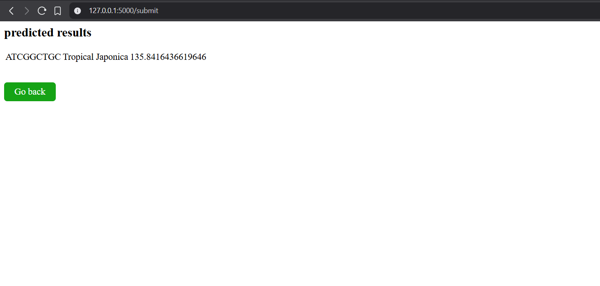

### Abstract
Accurately predicting plan height is a challenge but is vital for optimizing crop management, maximizing yield, improving disease resistance, enhancing environmental adaptation, ensuring efficient harvesting and streamlining breeding programs. 
Our analysis utilized GWAS and implemented Machine Learning (ML) and Deep Learning (DL) Models. We achieved more than 75% accuracy in classifying rice subpopulation and an accuracy range of 0.64 to 0.76 for predicting rice plant height based on genotype information. Using these models will enhance productivity and sustainability of agriculture

### Stage I
we are implementing biological classification and followed by Machine Learning / Deep Learning Techniques. Initially data is prepared and GWAS file is generated. in the second step Phylogenetic tree is constructed using UPGMA , Then clusters were extracted and labeled These clusters correspond to the different rice subpopulations (Indica, Aus, Aromatic, Temperate japonica, Tropical japonica, etc.).The original dataset was reorganized based on the extracted clusters. This biological clustering provided a natural way to classify the rice samples before applying computational methods.  
Then Machine learning techniques and Deep Learning Techniques are applied. we attempted to classify rice samples into different subpopulations (Indica, Aus, Aromatic, Temperate japonica, Tropical japonica) based on genetic information.Encoded DNA sequences (A, T, C, G) with numerical values (A:1.5, T:2.5, C:0.5, G:0.75).Addressed class imbalance using SMOTE. Then the data is fed into various models.  A comparison of various Machine Learning and Deep Learning techniques are illustrated below.

#### Models for subpopulation classification

| Model                          | Test-Size | Test-Accuracy| Precision| Recall |
|--------------------------------|-----------|--------------|----------|--------|
| XG-Boost Classifier            | 0.33      | 73.9         | 71.42    | 73.9   |
| Onevsrest Classifier (SVM)     | 0.33      | 73.64        | 68.3     | 67.09  |
| Logistic Regression            | 0.2       | 70.51        | 72.14    | 70.51  |
| Random Forest                  | 0.2       | 76.49        | 76.79    | 76.49  |
| ANN (Artificial Neural Network)| 0.33      | 73           | -        | -      |
| KNN                            | 0.2       | 74.78        | 76.23    | 74.78  |

### Stage II

After classification of subpopulation, based on the encoded genomic data and classified subpopulation (lable encoded) the height is predicted using various regression models illustrated below.

#### Models for height prediction

| Model              | MSE    | MAE   |
|--------------------|--------|-------|
| Linear Regression  | 364.7  | 14.73 |
| Random Forest      | 277.91 | 12.38 |
| XG Boost           | 211.12 | 10.17 |
| SVR                | 339.58 | 13.51 |
| ANN                | 334.9  | 17.85 |
| Bagging Regressor  | 428.19 | 15.4  |

### Conclusion
we classified O. Sativa samples based on their population type, which played a crucial role in predicting BVs. The findings revealed a substantial improvement in prediction accuracy compared to using entire population samples and other alternative methods. Among the various ML models evaluated, Random Forest (RF) and XGBoost demonstrated the most promising results.  
In summary, genomic data, including genetic markers and genomic selection methods, play a crucial role in predicting phenotypic traits in Oryza sativa.

### SnapShots
  
  

### Research Paper
Link: https://drive.google.com/file/d/1Jbxd9dEPzeUajNwfLL6g3qwqSPokDWgs/view?usp=sharing
